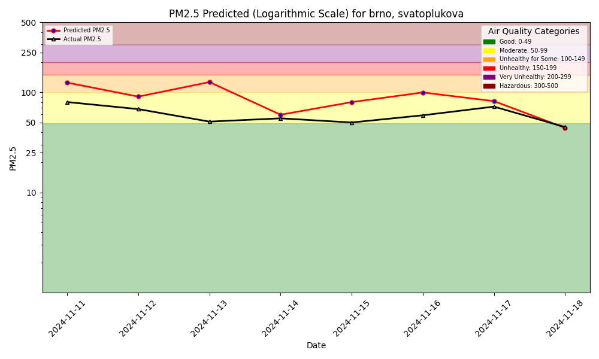

# ID2223 Assignment1 

The dashboard is available at https://samlama111.github.io/id2223-assignment1/.

## Forecast and Hindcast images

## Description

In the first assignment, we predict and plot air quality for a location. Using data from public APIs, we train a ML model to do so. Above, the forecast and hindcast plots of these predictions can be seen, generated every day using GitHub actions.

To present these plots, we've made a simple UI published on GitHub Pages.

In our project, we use a sensor from a city in Czechia - Brno. More concretely, the sensor situated on the Svatoplukova street.

We reused the code from the book (its public repo), namely the first 4 notebooks. There are changes that we had to make:
- `read_options={"use_hive": True}` when filtering.
- At places, we use `.select(columns_list)` instead of `.read()`.