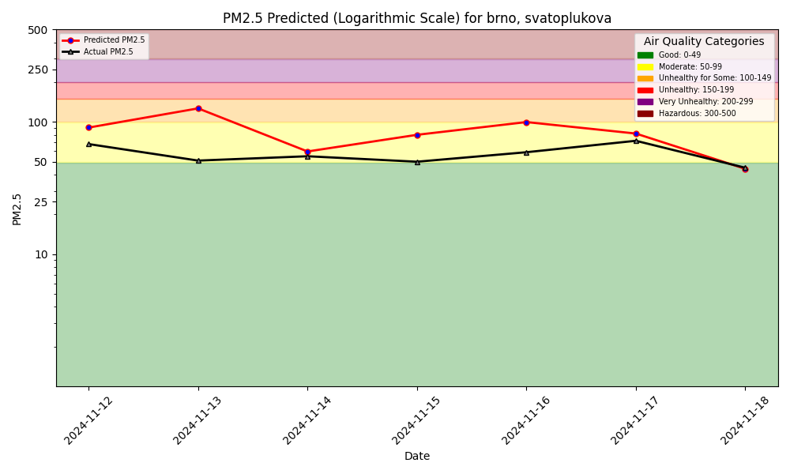

# ID2223 Assignment1 

The dashboard is available at https://samlama111.github.io/id2223-assignment1/.

## Forecast and Hindcast images

## Description

The premise of the first assignment is to predict the air quality (pm25 value) in a specific location given both air quality and weather data. The tutorial is based on a [tutorial repository](https://github.com/featurestorebook/mlfs-book/tree/main).

We use Python as our programming language and Hopsworks to save the feature groups and the model.

Using the data from the public APIs, we train a ML model and forecast the air quality for the upcoming week. Above, the forecast and hindcast plots of these predictions can be seen, generated every day using GitHub actions.

Each of the notebooks have a different purposes:

1. Fill the feature groups with historical data
2. Insert new data points (usually once a day)
3. Train the model
4. Predict the air quality

To present our results, we've made a simple UI published on GitHub Pages.

In our project, we use a sensor from a city in Czechia - Brno. More concretely, the sensor situated on the [Svatoplukova](https://aqicn.org/city/czechrepublic/jihomoravsky/brno-svatoplukova/) street.

## Extra Bonus
For the extra bonus task we added a new feature: **lagged air quality**. This new feature helps us to improve the prediction by taking the air quality of the last 3 days into account. For that we added the new feature to the feature group and added the new column in our code using a rolling window strategy and taking the mean.
